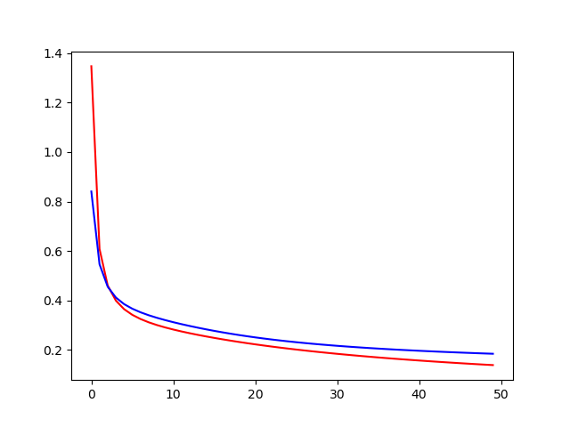
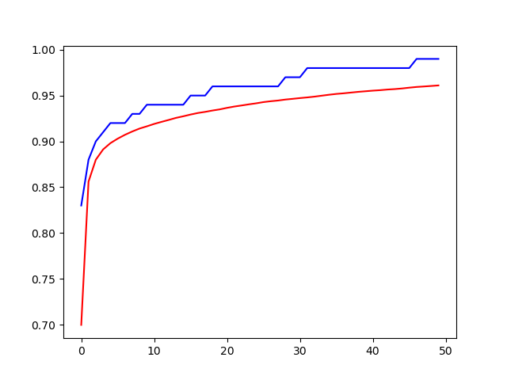

# 3 layer : Multi-Layer Perceptron
- 입력 레이어 노드 : 784개 
- 히든 레이어 노드 : 100
- 출력 레이어 노드 : 10개 
  
# Experiment 1
## Hyper Parameter
- learning_rate = 0.05
- EPOCH=50 
- BATCH=100 
- STEP=60 
- NODES=100

## Result
- Loss 그래프

빨간선 : Train Data 
파란선 : Test Data 

Loss가 줄어드는 추세 -> EPOCH 증가시켜줘도 될 것 같음

- Accuracy 그래프

빨간선 : Train Data 
파란선 : Test Data 

EPOCH을 파란석이 평평해질때 까지 더 해볼 필요가 있다.

## Conclusion
마지막 단계에서 classification softmax를 하면 Layer가 2개인 경우. 
보통 Layer를 하나더 줘서 3Layer로 Classification 을 하면 성능이 더 올라 갈 수 도있다.

\- 로스, 정확도 실험 해본다. -
- Hidden Node 갯수
- BATCH 크기
- EPOCH
- 또 Learning_rate 도 한번 수정해본다. (MNIST는 미세한 영향만 줄 수 있다. 따라서 조정은 필요 없다.)

# Experiment 2
## Hyper Parameter
- learning_rate = 0.05
- EPOCH=10 
- BATCH=1000 
- STEP=60

## Result

## Conclusion

# Experiment 3
## Hyper Parameter
- learning_rate = 0.05
- EPOCH=100 
- BATCH=1000 
- STEP=60

## Result

## Conclusion