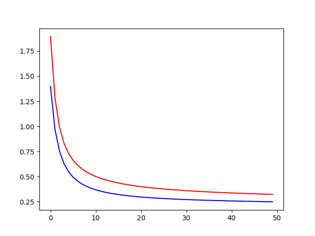

# **3 layer : Multi-Layer Perceptron**
- 입력 레이어 노드 : 784개 
- 히든 레이어 노드 : 100
- 출력 레이어 노드 : 10개 
  
# Experiment 1 (BATCH)
## Hyper Parameter
- learning_rate = 0.05
- EPOCH=50 
- BATCH=100 
- STEP=600 
- NODES=100 

## Result
- Loss 그래프 

빨간선 : Train Data 
파란선 : Test Data 

Loss가 줄어드는 추세 -> EPOCH 증가시켜줘도 될 것 같음

- Accuracy 그래프 

빨간선 : Train Data 
파란선 : Test Data 

EPOCH을 파란석이 평평해질때 까지 더 해볼 필요가 있다.

## Conclusion
마지막 단계에서 classification softmax를 하면 Layer가 2개인 경우. 
보통 Layer를 하나더 줘서 3Layer로 Classification 을 하면 성능이 더 올라 갈 수 도있다.

\- 로스, 정확도 실험 해본다. -
- Hidden Node 갯수
- BATCH 크기
- EPOCH
- 또 Learning_rate 도 한번 수정해본다. (MNIST는 미세한 영향만 줄 수 있다. 따라서 조정은 필요 없다.)

# Experiment 2 (Standard)
## Hyper Parameter
- learning_rate = 0.05
- EPOCH=50 
- BATCH=1000 
- NODES=100 

## Result
- ### Loss 그래프 

빨간선 : Train Data 
파란선 : Test Data 

Test Data의 Loss가 Train Data의 Loss 보다 더 낮게 나온다. 학습이 잘 됐다.

- ### Accuracy 그래프 

빨간선 : Train Data 
파란선 : Test Data 

Test Data의 정확도가 평평하게 잘 나온다.

## Conclusion
BATCH를 크게 늘려주니 결과가 매우 좋게 나온다. Batch사이즈를 늘리면 병렬로 처리함으로, **속도가 빠르다.** 

`train`  loss=0.34978718 accuracy=0.90203

`test`  **loss=0.26608020 accuracy=0.93800**

# Experiment 3 (NODES)
## Hyper Parameter
- learning_rate = 0.05
- EPOCH=50 
- BATCH=1000 
- NODES=500 

## Result
- ### Loss 그래프 

빨간선 : Train Data 
파란선 : Test Data 

Test Data의 Loss가 Train Data의 Loss 보다 더 낮게 나온다. 학습이 잘 됐다.

- ### Accuracy 그래프 

빨간선 : Train Data 
파란선 : Test Data 

Test Data의 정확도가 평평하게 잘 나온다.

## Conclusion
Hidden Node 들의 개수를 늘리면 Loss가 낮아지고, Accuracy도 조금 늘어난다.

`train`  loss=0.32399446 accuracy=0.90742

`test`  loss=0.25035542 accuracy=0.93700

# Experiment 4 (EPOCH)
## Hyper Parameter
- learning_rate = 0.05
- EPOCH=30 
- BATCH=1000 
- NODES=100 

## Result
- ### Loss 그래프 

빨간선 : Train Data 
파란선 : Test Data 

Loss가 평평하지 않다. EPOCH를 늘려 주면 될 것 같다.

- ### Accuracy 그래프 

빨간선 : Train Data 
파란선 : Test Data 

Accuracy가 좀 더 평평하게 만들어 주어야 할 것 같다.

## Conclusion
Hidden Node 들의 개수를 늘리면 Loss가 낮아지고, Accuracy도 조금 늘어난다.

`train`  loss=0.32399446 accuracy=0.90742

`test`  loss=0.25035542 accuracy=0.93700

# Experiment 5 (2-Layer)
## Hyper Parameter
- learning_rate = 0.05
- EPOCH=30 
- BATCH=1000 
- NODES=100 

## Result
- ### Loss 그래프 

빨간선 : Train Data 
파란선 : Test Data 

Loss가 평평하지 않다. EPOCH를 늘려 주면 될 것 같다.

- ### Accuracy 그래프 

빨간선 : Train Data 
파란선 : Test Data 

Layer를 한층 늘렸더니 정확도가 높아졌다! 

## Conclusion
Hidden Node 들의 개수를 늘리면 Loss가 낮아지고, Accuracy도 조금 늘어난다.

`train`  loss=0.34766302 accuracy=0.90407

`test`  loss=0.25741765 accuracy=0.94400
