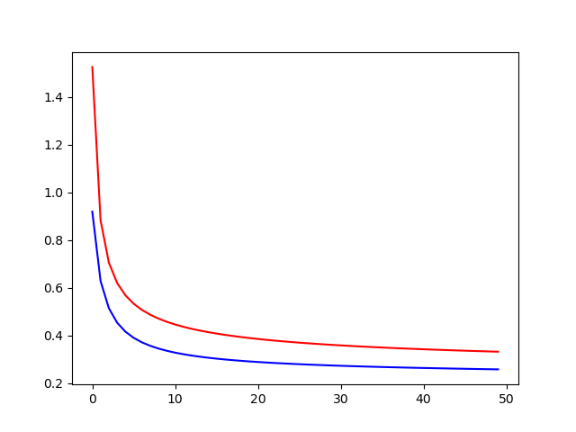
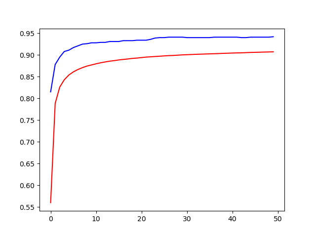
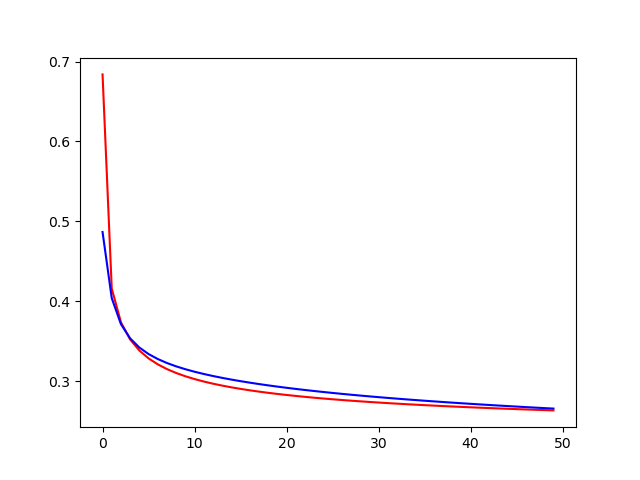
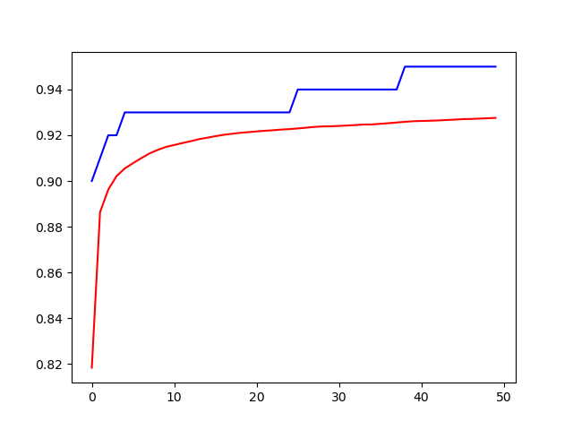

# **2 layer : Softmax Regression**
## 설계
- 입력 Layer 노드 : 784개 (28 x 28) 
- 출력 Layer 노드 : 10개(0~9)

## EPOCH, BATCH
그룹(batch)을 지어서 학습 하는 것이 추세. (local minimum에 빠질 위험이 적음 
ex 6만개중에 10개를 확률 적으로 뽑아서 GradentDescent 적용 
 -> Stocastic Gradient Descent Method 라고 함. 
local Minimum에 빠지는 것을 막아주는 효과가 있다.

1. epoch = 60000개의 학습 데이터를 학습에 한번 사용한 경우
   1. Batch크기를 얼마로 할 지 결정해 주어야 한다.
      - Batch Size : 1000개 => 60번 반복 해야지 60000
        - 60번 반복(1step) = 1 epoch 
      - Neural Network 얼마나 학습? == 몇 EPOCH 돌렸다.
2. Training 할때 중요한것
   1. **Epoch 크기**
   2. **Batch Size**

# Experiment 1
## Hyper Parameter
- learning_rate = 0.05
- EPOCH=50 
- BATCH=1000 
- STEP=60

## Result
- Loss 그래프

빨간선 : Train Data 
파란선 : Test Data 

급격하게 줄어서 완만하게 쭉 이어지는 그래프는 잘 학습 하였다는 표시 
보통은 Training Loss 가 작게나오고 Test Loss는 위로 나오는게 일반적이다.

- Accuracy 그래프

빨간선 : Train Data 
파란선 : Test Data 

Training Accuracy 가 Epoch을 주면 계속 올라간 
Test Acc 는 Epoch을 줘도 성능이 올라가지 않음.

그래서 Training 을 언제 멈추면 좋냐면 19, 20 Epoch 때의 학습 file을 쓰는 것이 좋다. (save()를 통해 저장.)

## Conclusion
`train` loss=0.33136824, accuracy=0.90727 
`test` loss=0.25727901, accuracy=0.94200 
Memory만 허용된다면 Batch사이즈를 크게 처리하면 병렬로 처리함으로 **빠름**

# Experiment 2
## Hyper Parameter
- learning rate : 0.05
- EPOCH : 50 
- BATCH : 100
- STEP : 600

## Result
- Loss 그래프

빨간선 : Train Data 
파란선 : Test Data 

- Accuracy 그래프

빨간선 : Train Data 
파란선 : Test Data 
이거 왜이래 이거 ..? 

## Conclusion
`train` loss=0.26323506, accuracy=0.92760 
`test` loss=0.26551130, accuracy=0.95000 
오래걸린다.